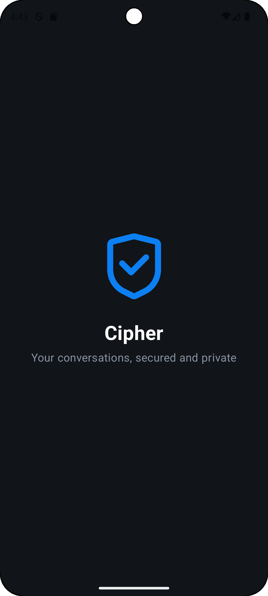
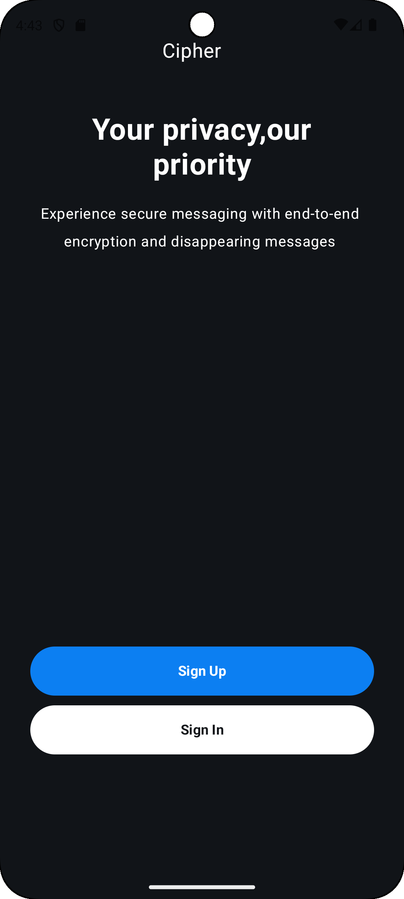
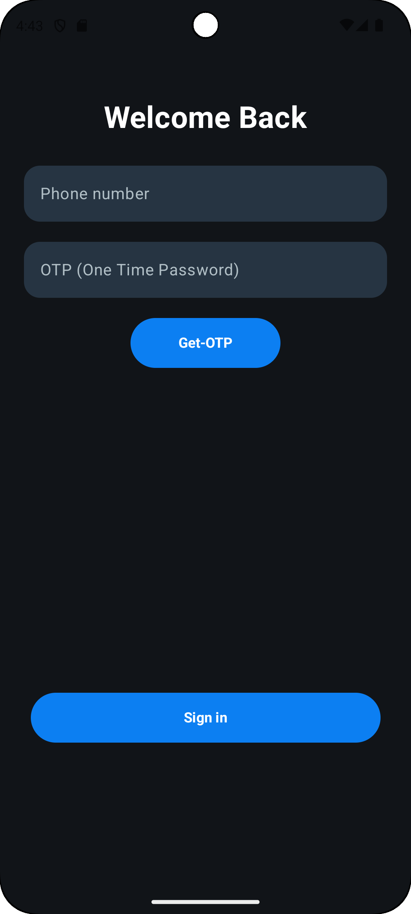
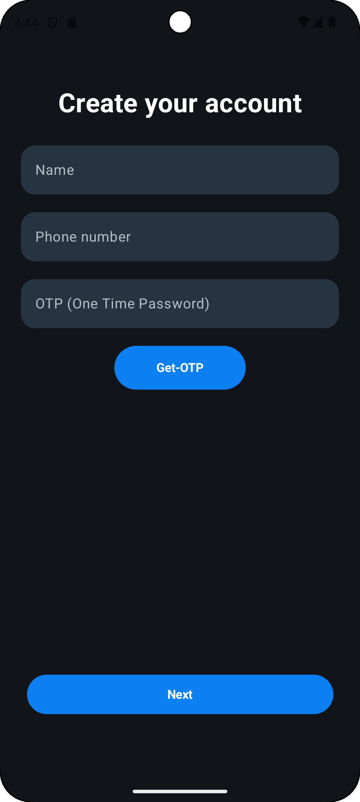

# Cipher-Chat-App-
# Cipher Chat App

Cipher Chat App is a secure, end-to-end encrypted personal chat application built using **Kotlin**, **Jetpack Compose**, and **Firebase**. It demonstrates modern Android development with security best practices, designed for demonstration and portfolio purposes.

---

## ✨ Features

- 📱 Modern Jetpack Compose UI
- 🔐 End-to-end encryption with AES + RSA
- ☁️ Real-time chat messaging using Firestore
- 🔑 Phone Number Authentication (Firebase Auth)
- 🔎 Searchable chat list
- 👤 Basic profile management
- 🔒 Secure key storage with Android Keystore
- 🛡️ Firestore security rules
- ⚙️ MVVM architecture
- 🚀 Clean, scalable code structure

---

## 🛠 Tech Stack

- Kotlin
- Jetpack Compose (Material 3)
- Firebase Authentication
- Firebase Firestore
- Android Keystore
- MVVM architecture
- Gradle

---

## 📸 Screenshots

| Splash Screen                       | Authentication Choice                 |
|-------------------------------------|---------------------------------------|
|    |  |

| Sign In                             | Sign Up                               |
|-------------------------------------|---------------------------------------|
|   |     |
